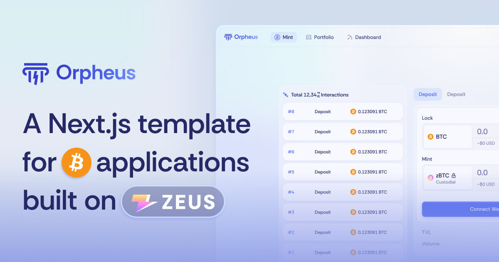
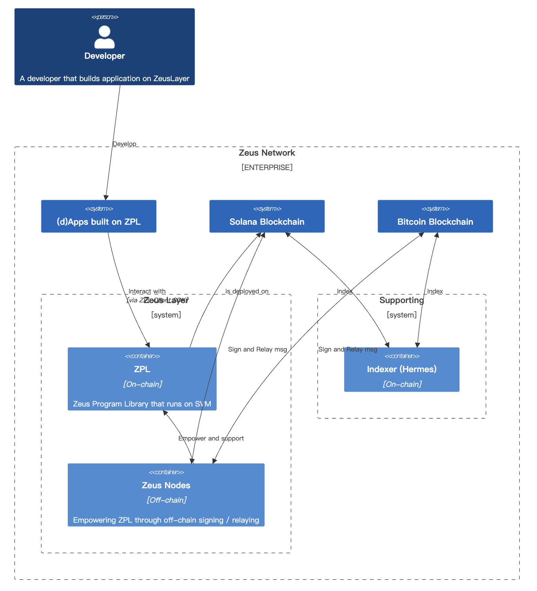
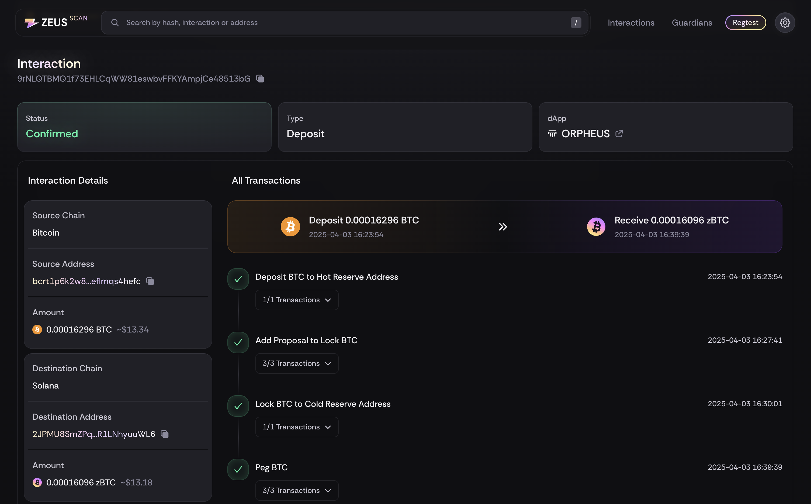
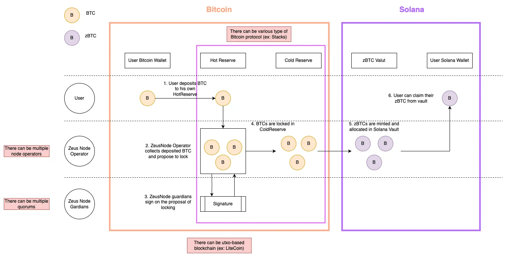
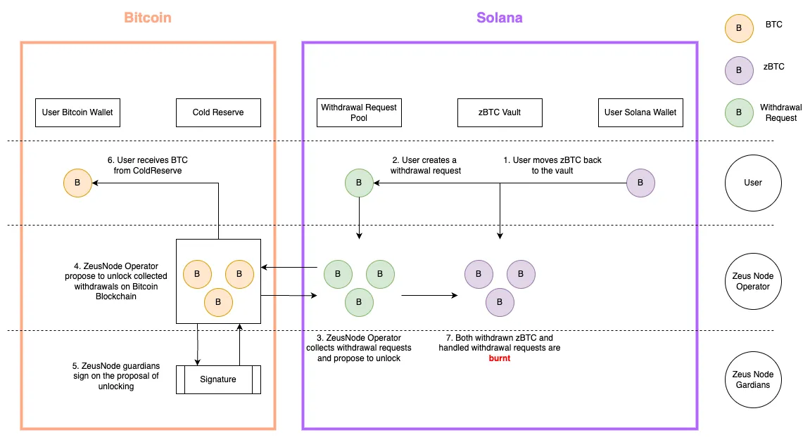
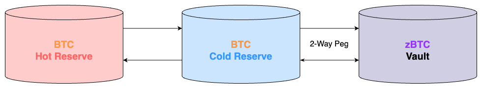
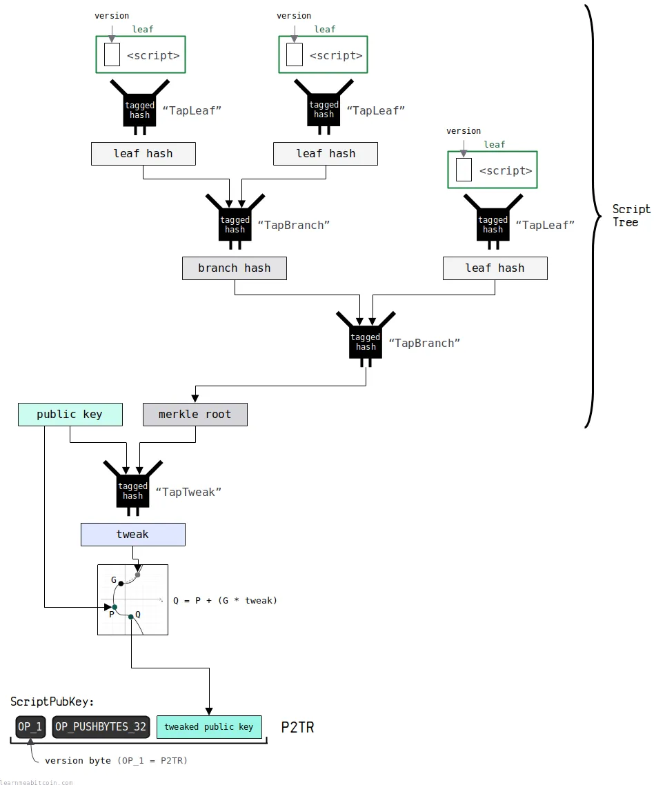
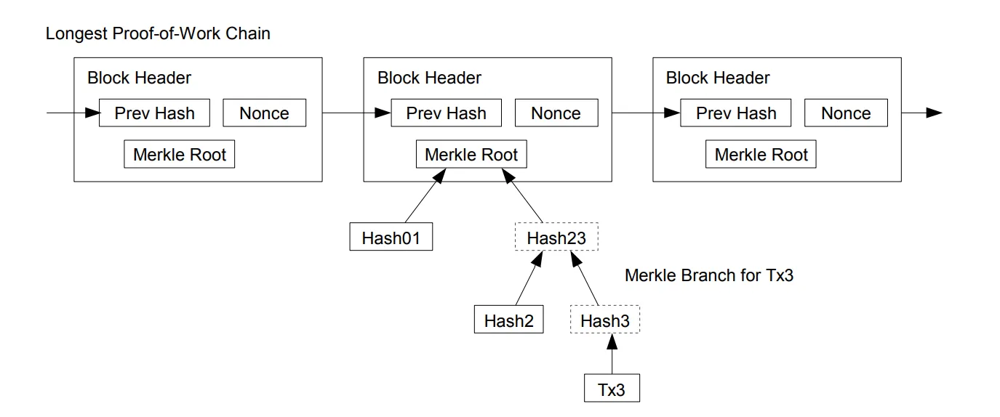
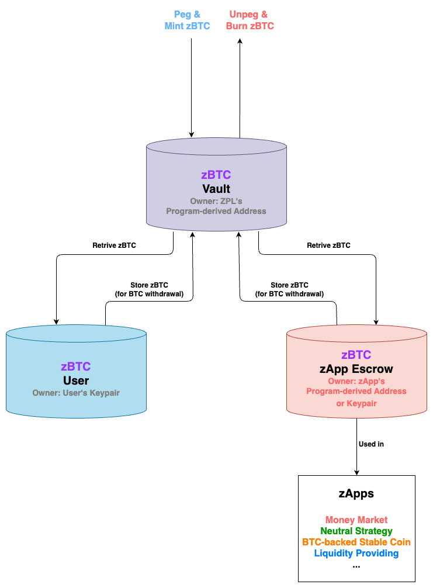

# Orpheus



Orpheus is a Next.js-based template engineered for Bitcoin-centric applications, architected atop the ZeusLayer infrastructure. This documentation delivers a meticulous and comprehensive manual for developers, elucidating the methodologies for leveraging this frontend template to interface with the Zeus Program Library (ZPL) and implement cross-chain operability between Bitcoin and Solana. The ZPL underpins this integration by providing a robust framework for seamless interoperability, synergizing Bitcoin’s liquidity with Solana’s high-performance programmability. This empowers developers to construct sophisticated applications that optimally exploit the complementary technical attributes of both blockchain.

## Table of Contents

- [Getting Started](#getting-started)
- [Overview](#overview)
  - [Components](#core-components)
  - [Layer Roles](#layer-roles)
  - [Reserves](#reserves)
  - [Core Concepts](#core-concepts)
- [Interact with ZeusLayer via ZPL Client](#interact-with-zeuslayer-via-zpl-client)
- [Build a Bitcoin Applicaiton in 4 Steps](#build-a-bitcoin-applicaiton-in-4-steps)
  - [Step 1: Tracking Interactions](#step-1-tracking-interactions)
  - [Step 2: Create HotReserveBucket](#step-2-create-hotreservebucket)
  - [Step 3: Lock BTC to Mint zBTC](#step-3-lock-btc-to-mint-zbtc)
  - [Step 4-1: Redeem zBTC from Custodial](#step-4-1-redeem-zbtc-from-custodial)
  - [Step 4-2: Withdraw zBTC to BTC](#step-4-2-withdraw-zbtc-to-btc)

## Getting Started

To run this example template, run the development server:

```bash
npm ci && npm run dev
```

## Overview



ZeusLayer is a cross-chain layer that enables interoperability between Bitcoin and programmable blockchains like Solana. The architecture is designed to provide security, scalability, and a seamless user experience across both chains.

### Lifecycle of Interactions



Check the live Interaction data on [ZeusScan](https://zeusscan.io/?network=regtest-devnet)

#### Deposit Flow



#### Withdrawal Flow



### Core Components

- **ZPL (Zeus Program Library)**: A set of Solana programs that run on-chain, including:

  - **BitcoinSPV**: Verifies Bitcoin transactions using simplified payment verification
  - **TwoWayPeg**: Manages the pegging and unpegging of assets between chains
  - **LiquidityManagement**: Handles asset storage, retrieval, and liquidity pools

- **ZeusNode**: Off-chain components that handle:
  - **Transaction Signing**: Securely sign cross-chain transactions
  - **Relaying**: Propagating transactions between Bitcoin and Solana
  - **Monitoring**: Tracking transaction status and system health

### Layer Roles

- **Operator**:
  - Manages the system operations
  - Monitors deposits and withdrawal requests
  - Proposes transactions for guardian approval
- **Guardian (Signing Entity)**:
  - Provides security through multi-signature
  - Validates and approves cross-chain operations
  - Manages key recovery and emergency procedures

### Reserves



There are two types of reserves to manage Bitcoin assets:

#### HotReserve (Bitcoin)

HotReserve is a temporary storage for user deposits before they are moved to ColdReserve:

- Short-term storage for user deposits
- Provides quick access for frequent operations
- Uses Taproot addresses with user-specific script paths

#### ColdReserve (Bitcoin)

ColdReserve is a long-term secure storage for pooled Bitcoin:

- Long-term, secure storage for Bitcoin
- Higher security with multi-signature protection
- Uses Taproot addresses with time-locked script paths

#### zBTC Vault

zBTC is a wrapped representation of Bitcoin on Solana:

- **SPL Token**: Follows the Solana Program Library token standard
- **1:1 Backing**: Each zBTC is backed by an equivalent amount of BTC in reserves
- **Programmable**: Can be used in Solana DeFi applications

zBTC vault manages the issuance and redemption of zBTC tokens:

- **Token Minting**: Creates new zBTC when BTC is deposited
- **Token Burning**: Burns zBTC when BTC is withdrawn
- **Balance Tracking**: Ensures the system maintains proper reserves

### Core Concepts

#### Bitcion Taproot



ZeusLayer leverages Bitcoin's Taproot technology (BIP 341), which provides enhanced privacy and flexibility:

- **Key-path Spend**: Uses the Guardian's internal X-only public key for standard operations
  - More efficient and private spending path
  - Lower transaction fees
  - Indistinguishable from regular Bitcoin transactions
- **Script-path Spend**: Uses the User's X-only public key with time-locked scripts for recovery
  - Enables complex spending conditions
  - Provides backup recovery mechanisms
  - Allows for time-locked security features

#### Simplified Payment Verification (SPV)



We deploy a BitcoinSPV program on Solana that verifies Bitcoin transactions without requiring a full Bitcoin node:

- **Block Headers**: Validates the Bitcoin blockchain structure
- **Merkle Proofs**: Confirms transaction inclusion in blocks
- **Transaction Parsing**: Extracts relevant data from Bitcoin transactions

## Interact with ZeusLayer via ZPL Client

The ZPL Client is the main entry point for interacting with the Zeus Program Library. It provides methods for account management, instruction creation, and transaction submission. The client abstracts the complexity of interacting with the Solana blockchain and the ZPL programs, making it easier for developers to build applications on top of ZPL.

### Client Architecture

The ZPL Client is composed of three main modules:

1. **Account**: Handles account derivation and data fetching
2. **Instruction**: Creates instructions for various operations
3. **RpcClient**: Manages transaction signing and submission

### Initialization

```typescript
import { ZplClient } from "@/zplClient";
import { Connection, PublicKey } from "@solana/web3.js";

// Initialize ZPL Client
const zplClient = new ZplClient(
  connection, // Solana connection
  walletPublicKey, // Connected wallet public key
  signTransaction, // Function to sign transactions
  twoWayPegProgramId, // Program ID for two-way peg
  liquidityManagementProgramId, // Program ID for liquidity management
  assetMint // Asset mint address
);
```

### Using ZplClient with React

For React applications, you can use the provided `ZplClientProvider` and `useZplClient` hook to access the client throughout your application:

```typescript
import { ZplClientProvider, useZplClient } from "@/contexts/ZplClientProvider";
import { useConnection, useWallet } from "@solana/wallet-adapter-react";

// In your app's root component
function App() {
  return (
    <ZplClientProvider>
      <YourComponent />
    </ZplClientProvider>
  );
}

// In your component
function YourComponent() {
  const zplClient = useZplClient();

  // Now you can use zplClient to interact with ZPL
  // ...
}
```

### Client Capabilities

The ZPL Client provides the following capabilities:

1. **Account Management (/zplClient/account.ts)**:

   - Deserialize on-chain hot reserve buckets, cold reserve buckets, positions, and two-way peg configuration into objects
   - Derive program addresses, for example:
     - TwoWayPeg/LiquidityManagement configuration, LiquidityManagementGuardianSetting, and SplTokenVaultAuthority address
     - Hot/Cold reserve bucket address with/without user's public key
     - Interaction address given transaction ID and slot (we store each deposit/withdraw txns onchain to track their status)
     - Position address given user's public key

2. **Instruction Creation (/zplClient/instruction.ts)**:

   - Create/Reactivate hot reserve buckets for deposits
   - Add zBTC to tBTC withdrawal requests
   - Store/retrieve zBTC to/from the vault

3. **Transaction Submission (/zplClient/rpcClient.ts)**:
   - Sign and send transactions with multiple instructions

## Build a Bitcoin Applicaiton in 4 Steps

This section details the primary operations that developers can perform using the ZPL. Each operation includes a description of its purpose, the required parameters, and code examples for implementation.

### Step 1: Tracking Interactions

The ZPL provides a comprehensive system for tracking cross-chain interactions through interactions. This section explains how to fetch and monitor transaction status.

#### Purpose

- Allows users to track the status of their cross-chain interactions
- Provides transparency into the multi-step process of deposits and withdrawals
- Enables developers to build informative UIs showing transaction progress

#### When to Use

- When displaying interaction history to users
- When monitoring the progress of ongoing interaction
- When building dashboards or analytics for cross-chain activity

#### Implementation

```typescript
import { useZplClient } from "@/zplClient";
import { Interaction, interactionSchema, transactionSchema } from "@/types/api";
import { useFetchers } from "@/hooks/misc/useFetchers";
import { useTwoWayPegConfiguration } from "@/hooks/zpl/useTwoWayPegConfiguration";
import { useNetworkConfig } from "@/hooks/misc/useNetworkConfig";
import useDepositInteractionsWithCache from "@/hooks/ares/useDepositInteractionsWithCache";
import { PublicKey } from "@solana/web3.js";

export default function getTransactions({ solanaPubkey, bitcoinWallet }) {
  const zplClient = useZplClient();
  const { aresFetcher, hermesFetcher } = useFetchers();
  const { feeRate } = useTwoWayPegConfiguration();
  const config = useNetworkConfig();

  // Fetch deposit transactions (combined onchain transaction and transaction in browser indexed db)
  const { combinedInteractions: depositTransactions } =
    useDepositInteractionsWithCache({
      solanaAddress: solanaPubkey?.toBase58(),
      bitcoinXOnlyPubkey: bitcoinWallet
        ? toXOnly(Buffer.from(bitcoinWallet.pubkey, "hex")).toString("hex")
        : undefined,
    });

  // Fetch withdrawal transactions
  const {
    data: withdrawalTransactions,
    hasNextPage,
    currentPage,
    itemsPerPage,
    handleItemsPerPage,
    handleNextPage,
    handlePrevPage,
  } = useInteractions(
    {
      solanaAddress: solanaPubkey?.toBase58(),
      destinationBitcoinAddress: bitcoinWallet
        ? convertP2trToTweakedXOnlyPubkey(bitcoinWallet.p2tr).toString("hex")
        : undefined,
      types: [InteractionType.Withdrawal],
      statuses: [
        InteractionStatus.AddWithdrawalRequest,
        InteractionStatus.AddUnlockToUserProposal,
        InteractionStatus.BitcoinUnlockToUser,
        InteractionStatus.VerifyUnlockToUserTransaction,
        InteractionStatus.SolanaUnlockToUser,
      ],
    },
    10
  );

  // This is the schema of a interaction
  // amount: "TXN_SATS_AMOUNT"
  // app_developer: "" // from which app (Orpheus)
  // current_step_at: TIMESTAMP_OF_LATEST_STEP
  // deposit_block: BLOCK_NUMBER_OF_DEPOSIT_TO_HOTRESERVE
  // destination: "YOUR_SOLANA_ADDRESS"
  // guardian_certificate: "GUARDIAN_CERTIFICATE_ADDRESS"
  // guardian_setting: "GUARDIAN_SETTING_ADDRESS"
  // initiated_at: TIMESTAMP_OF_TRANSACTION_BE_SENT_ON_SOLANA
  // interaction_id: "INTERACTION_ACCOUNT_ADDRESS"
  // interaction_type: 0 (Deposit), 1 (Withdraw)
  // miner_fee: "MINER_FEE_ON_ZEUS_NODE"
  // service_fee: "SERVICE_FEE" (Only on Withdrawal)
  // source: "XONLY_PUBKEY_OF_HOTRESERVE"
  // status: "YOUR_TX_STATUS" (more details below)
  // steps: [{
  //     transaction: "TXN_ID",
  //     chain: "Bitcoin" or "Solana",
  //     action: "YOUR_STEP_STATUS",
  //     timestamp: TIMESTAMP_OF_STEP_STATUS
  // }]
  // withdrawal_request_pda: "YOUR_WITHDRAWAL_REQUEST_PDA"

  // Or you can specify the interaction id and fetch the interaction detail from our indexer API
  const targetTx = depositTransactions[0]; // choose the first transaction as example
  const interactionSteps = await hermesFetcher(
    `/api/v1/raw/layer/interactions/${targetTx.interaction_id}/steps`,
    interactionSchema
  );
  // The returned data is in the same format as the combinedInteractions above

  // Below api returns the Bitcoin transaction detail from Bitcoin RPC
  const transactionDetail = await aresFetcher(
    `/api/v1/transaction/${targetTx.steps[0].transaction}/detail`,
    transactionSchema
  );
  // This is the schema of the bitcoin transaction detail
  // blockhash: "TXN_BLOCK_HASH"
  // blocktime: TIMESTAMP_OF_TXN
  // confirmations: CONFIRMATIONS_OF_TXN
  // time: TIMESTAMP_OF_TXN
  // transaction: "TXN_ID"
}
```

#### Understanding Interaction Types and Statuses

The ZPL defines several interaction types and statuses to track the progress of cross-chain transactions:

**Interaction Types:**

- `InteractionType.Deposit`: Represents a deposit from Bitcoin to Solana
- `InteractionType.Withdrawal`: Represents a withdrawal from Solana to Bitcoin

**Deposit Statuses (in order):**

1. `BitcoinDepositToHotReserve`: Initial deposit detected on Bitcoin network from user address to our hot reserve address
2. `VerifyDepositToHotReserveTransaction`: BitcoinSPV program verifying the deposit transaction
3. `SolanaDepositToHotReserve`: Deposit confirmed on Solana by TwoWayPeg program
4. `AddLockToColdReserveProposal`: Zeus node send transaction to move BTC from hot reserve to cold reserve
5. `BitcoinLockToColdReserve`: Move BTC from hot reserve to cold reserve transaction is observed on Bitcoin network
6. `VerifyLockToColdReserveTransaction`: BitcoinSPV program verifying cold reserve transaction
7. `SolanaLockToColdReserve`: Funds secured in cold reserve
8. `Peg`: zBTC tokens minted in custody

**Withdrawal Statuses (in order):**

1. `AddWithdrawalRequest`: Withdrawal request submitted on Solana, waiting for Zeus node to process
2. `AddUnlockToUserProposal`: Zeus node send transaction to move zBTC from cold reserve to user wallet
3. `BitcoinUnlockToUser`: Unlocking Bitcoin from cold reserve
4. `VerifyUnlockToUserTransaction`: BitcoinSPV program verifying Bitcoin transaction
5. `SolanaUnlockToUser`: Confirming withdrawal on Solana
6. `Unpeg`: Burning zBTC tokens
7. `DeprecateWithdrawalRequest`: Withdrawal request has been canceled (between AddWithdrawalRequest and AddUnlockToUserProposal)

### Step 2: Create HotReserveBucket

Before users can deposit Bitcoin into the system, they need to create a hot reserve bucket. This bucket serves as a temporary storage location for user deposits before they are moved to the cold reserve.

#### Purpose

- Creates a unique Bitcoin Taproot address for the user to deposit funds
- Associates the user's Solana wallet with their Bitcoin deposit address
- Establishes the necessary on-chain accounts for tracking deposits

#### When to Use

- When a user wants to deposit Bitcoin for the first time
- When a user's previous hot reserve bucket has expired or been deactivated

#### Implementation

This functionality is already implemented in this repo. You just need to use the following hooks:

```typescript
import useHotReserveBucketActions from "@/hooks/zpl/useHotReserveBucketActions";
import { useBitcoinWallet } from "@/contexts/BitcoinWalletProvider";
import { CheckBucketResult } from "@/types/misc";

function YourComponent() {
  // Get the connected wallet
  const { wallet: bitcoinWallet } = useBitcoinWallet();

  // Get hot reserve bucket actions
  const {
    createHotReserveBucket,
    reactivateHotReserveBucket,
    checkHotReserveBucketStatus,
  } = useHotReserveBucketActions(bitcoinWallet);

  // Check if user has an active hot reserve bucket
  const checkAndPrepareHotReserveBucket = async () => {
    const bucketStatus = await checkHotReserveBucketStatus();

    if (bucketStatus?.status === CheckBucketResult.NotFound) {
      // Create a new hot reserve bucket if none exists
      await createHotReserveBucket();
    } else if (
      bucketStatus?.status === CheckBucketResult.Expired ||
      bucketStatus?.status === CheckBucketResult.Deactivated
    ) {
      // Reactivate if expired or deactivated
      await reactivateHotReserveBucket();
    }
  };
}
```

The `useHotReserveBucketActions` hook handles all the complexity of interacting with the ZPL client, including:

- Getting guardian settings and cold reserve buckets
- Deriving Bitcoin addresses using Taproot
- Constructing and sending transactions

### Step 3: Lock BTC to Mint zBTC

The process of locking BTC (Bitcoin on the Bitcoin network) to mint zBTC (wrapped Bitcoin on Solana) involves several steps. This section details the complete flow from checking bucket status to monitoring deposit progress.

#### Purpose

- Allows users to convert their Bitcoin to zBTC for use in Solana applications
- Ensures secure and verifiable cross-chain transfers
- Maintains 1:1 backing of zBTC with real Bitcoin

#### When to Use

- When a user wants to bring Bitcoin into the Solana ecosystem

#### Implementation

The deposit process is already implemented through various hooks in the codebase. Here's a simplified implementation that uses these existing hooks to implement a deposit button with input amount:

```typescript
import { useState } from "react";
import { useWallet } from "@solana/wallet-adapter-react";
import usePersistentStore from "@/stores/persistentStore";
import { useBitcoinWallet } from "@/contexts/BitcoinWalletProvider";
import useBitcoinUTXOs from "@/hooks/ares/useBitcoinUTXOs";
import useTwoWayPegConfiguration from "@/hooks/zpl/useTwoWayPegConfiguration";
import * as bitcoin from "bitcoinjs-lib";
import { useNetworkConfig } from "@/hooks/misc/useNetworkConfig";
import { useZplClient } from "@/contexts/ZplClientProvider";
import { constructDepositToHotReserveTx, convertBitcoinNetwork, btcToSatoshi } from "@/bitcoin";
import { createAxiosInstances } from "@/utils/axios";
import { getInternalXOnlyPubkeyFromUserWallet } from "@/bitcoin/wallet";
import { sendTransaction } from "@/bitcoin/rpcClient";

export default function Home() {
  const [depositAmount, setDepositAmount] = useState(0);

  const bitcoinNetwork = usePersistentStore((state) => state.bitcoinNetwork);
  const solanaNetwork = usePersistentStore((state) => state.solanaNetwork);
  const networkConfig = useNetworkConfig();
  const {
    wallet: bitcoinWallet,
    signPsbt,
  } = useBitcoinWallet();
  const { publicKey: solanaPubkey } = useWallet();
  const zplClient = useZplClient();

  if(!zplClient || !solanaPubkey || !bitcoinWallet) {
    console.log("ZPL Client not found");
  }
  const { feeRate } = useTwoWayPegConfiguration();

  const { data: bitcoinUTXOs } = useBitcoinUTXOs(
    bitcoinWallet?.p2tr
  );
  const handleDeposit = async () => {
    const userXOnlyPublicKey =
        getInternalXOnlyPubkeyFromUserWallet(bitcoinWallet);

      if (!userXOnlyPublicKey)
        throw new Error("User X Only Public Key not found");

      // although we have a array of hotReserveBuckets, but the user could only bind one bitcoin address with the protocol, so we only need to get the first one
      const hotReserveBuckets =
        await zplClient.getHotReserveBucketsByBitcoinXOnlyPubkey(
          userXOnlyPublicKey
        );

      if (!hotReserveBuckets || hotReserveBuckets.length === 0) {
        console.log("No hot reserve address found");
        return;
      }

      // NOTE: Regtest and Testnet use the same ZPL with different guardian settings, so we need to set guardian setting in env
      const targetHotReserveBucket = hotReserveBuckets.find(
        (bucket) =>
          bucket.guardianSetting.toBase58() === networkConfig.guardianSetting
      );
      if (!targetHotReserveBucket) throw new Error("Wrong guardian setting");

      const { address: targetHotReserveAddress } = bitcoin.payments.p2tr({
        pubkey: Buffer.from(targetHotReserveBucket.taprootXOnlyPublicKey),
        network: convertBitcoinNetwork(bitcoinNetwork),
      });

      if (!targetHotReserveAddress) {
        console.log("Hot reserve address not found");
        return;
      }
      let depositPsbt;
      try {
        const { psbt } = constructDepositToHotReserveTx(
          bitcoinUTXOs,
          targetHotReserveAddress,
          btcToSatoshi(depositAmount),
          userXOnlyPublicKey,
          feeRate,
          convertBitcoinNetwork(bitcoinNetwork),
          false
        );
        depositPsbt = psbt;
      } catch (e) {
        if (e instanceof Error && e.message === "Insufficient UTXO") {
          console.log("Insufficient UTXO, please adjust the amount");
          return;
        } else {
          throw e;
        }
      }

      try {
        const signTx = await signPsbt(depositPsbt, true);

        const { aresApi } = createAxiosInstances(solanaNetwork, bitcoinNetwork);

        const txId = await sendTransaction(aresApi, signTx);
        console.log(txId);

      }
      catch (e) {
        console.error(e);
      }
    }

  return (
    <div>
      {/* Deposit input and button */}
      <input
        type="number"
        value={depositAmount}
        onChange={(e) => setDepositAmount(Number(e.target.value))}
        placeholder="Amount to deposit"
      />
      <button onClick={handleDeposit}>Deposit</button>
    </div>
  );
}
```

This implementation leverages the following hooks:

### Step 4-1: Redeem zBTC from Custodial

The ZPL provides functionality for users to store zBTC in a custodial vault and retrieve it when needed. This section explains the store and retrieve operations in detail.

#### Purpose

- Provides a secure way to store zBTC in a custodial vault
- Allows users to retrieve their zBTC when needed

#### When to Use

- **Store**: When a user wants to secure their zBTC without converting back to Bitcoin
- **Retrieve**: When a user wants to access previously stored zBTC for use in Solana applications

#### Redeem zBTC to your Bitcoin application



Orpheus allows you to modify the retrieval address to designate an alternative Escrow token account managed by your application. By implementing this change, redemption transactions initiated by users of your application will direct funds to the application-controlled escrow rather than the user’s individual wallet. This functionality unlocks a range of decentralized finance (DeFi) use cases, including money markets, neutral trading strategies, liquidity provisioning, or the development of a Bitcoin-backed stablecoin.

```typescript
constructRetrieveIx(
  amount: BN,
  guardianSetting: PublicKey,
  receiverAta: PublicKey
) {

...

const ix = new TransactionInstruction({
    keys: [
      {
        pubkey: this.walletPublicKey,
        isSigner: true,
        isWritable: true,
      },
      { pubkey: receiverAta, isSigner: false, isWritable: true },
      { pubkey: positionPda, isSigner: false, isWritable: true },
      { pubkey: lmGuardianSetting, isSigner: false, isWritable: false },
      { pubkey: splTokenVaultAuthority, isSigner: false, isWritable: false },
      { pubkey: vaultAta, isSigner: false, isWritable: true },
      { pubkey: this.assetMint, isSigner: false, isWritable: false },
      { pubkey: SystemProgram.programId, isSigner: false, isWritable: false },
      { pubkey: TOKEN_PROGRAM_ID, isSigner: false, isWritable: false },
      {
        pubkey: ASSOCIATED_TOKEN_PROGRAM_ID,
        isSigner: false,
        isWritable: false,
      },
    ],
    programId: this.liquidityManagementProgramId,
    data: instructionData,
  });

  return ix;
}
```

For guidance on constructing a Solana escrow, developers may consult reference implementations utilizing either the Anchor framework or native Rust programming paradigms:

- https://github.com/ironaddicteddog/anchor-escrow
- https://github.com/deanmlittle/native-escrow-2024

#### Implementation

```typescript
import { useState } from "react";
import { useWallet } from "@solana/wallet-adapter-react";
import { useZplClient } from "@/contexts/ZplClientProvider";
import usePositions from "@/hooks/zpl/usePositions";
import { useNetworkConfig } from "@/hooks/misc/useNetworkConfig";
import { PublicKey, TransactionInstruction } from "@solana/web3.js";
import BigNumber from "bignumber.js";
import { BN } from "bn.js";
import { BTC_DECIMALS } from "@/utils/constant";
export default function Home() {
  const [redeemAmount, setRedeemAmount] = useState(0);

  const config = useNetworkConfig();
  const zplClient = useZplClient();
  const { publicKey: solanaPubkey } = useWallet();
  const { data: positions } = usePositions(solanaPubkey);

  const handleRedeem = async () => {
      if (!redeemAmount || !zplClient) return;

      try {
        if (!positions) return;

        const sortedPositions = positions.toSorted((a, b) =>
          b.storedAmount
            .sub(b.frozenAmount)
            .cmp(a.storedAmount.sub(a.frozenAmount))
        );

        const redeemAmountBN = new BN(
          new BigNumber(redeemAmount)
            .multipliedBy(new BigNumber(10).pow(BTC_DECIMALS))
            .toString()
        );

        const ixs: TransactionInstruction[] = [];

        let remainingAmount = redeemAmountBN.clone();
        for (const position of sortedPositions) {
          const amountToRedeem = BN.min(
            position.storedAmount.sub(position.frozenAmount),
            remainingAmount
          );

          const twoWayPegGuardianSetting = config.guardianSetting;

          if (!twoWayPegGuardianSetting)
            throw new Error("Two way peg guardian setting not found");

          const retrieveIx = zplClient.constructRetrieveIx(
            amountToRedeem,
            new PublicKey(twoWayPegGuardianSetting)
          );

          ixs.push(retrieveIx);
          remainingAmount = remainingAmount.sub(amountToRedeem);

          if (remainingAmount.eq(new BN(0))) break;
        }

        const sig = await zplClient.signAndSendTransactionWithInstructions(ixs);
        console.log(sig);
      } catch (error) {
        console.log(error);
    };
  }
  return (
    <div>
      <input
        type="number"
        value={redeemAmount}
        onChange={(e) => setRedeemAmount(Number(e.target.value))}
      />
      <button onClick={handleRedeem}>Redeem</button>
    </div>
  );
}
```

Each position contains information about the amount stored, the guardian setting, and other metadata.

### Step 4-2: Withdraw zBTC to BTC

The withdrawal process allows users to convert their zBTC back to native Bitcoin. This section details the complete flow from creating a withdrawal request to monitoring its progress.

#### Purpose

- Allows users to convert their zBTC back to native Bitcoin
- Ensures secure and verifiable cross-chain transfers
- Provides a way to exit the Solana ecosystem back to Bitcoin

#### When to Use

- When a user wants to move their assets from Solana back to Bitcoin
- When a user wants to realize gains or use their Bitcoin outside of Solana
- When a user needs to access their Bitcoin for other purposes

#### Implementation

```typescript
import { useState } from "react";
import { useWallet } from "@solana/wallet-adapter-react";
import { useBitcoinWallet } from "@/contexts/BitcoinWalletProvider";
import usePersistentStore from "@/stores/persistentStore";
import { useZplClient } from "@/contexts/ZplClientProvider";
import usePositions from "@/hooks/zpl/usePositions";
import useTwoWayPegGuardianSettings from "@/hooks/hermes/useTwoWayPegGuardianSettings";
import { useConnection } from "@solana/wallet-adapter-react";
import useHotReserveBucketsByOwner from "@/hooks/zpl/useHotReserveBucketsByOwner";
import { PublicKey, TransactionInstruction } from "@solana/web3.js";
import { getAccount, getAssociatedTokenAddressSync } from "@solana/spl-token";
import { convertP2trToTweakedXOnlyPubkey, xOnlyPubkeyHexToP2tr } from "@/bitcoin";
import BigNumber from "bignumber.js";
import { BN } from "bn.js";
import { BTC_DECIMALS } from "@/utils/constant";
import { formatValue } from "@/utils/format";
export default function Home() {
  const [withdrawAmount, setWithdrawAmount] = useState(0);
  const assetFrom = {
    name: "zBTC",
    amount: formatValue(withdrawAmount, 6),
    isLocked: true, // NOTE: asset is in vault
  }

  const bitcoinNetwork = usePersistentStore((state) => state.bitcoinNetwork);

  const { publicKey: solanaPubkey } = useWallet();
  const { wallet: bitcoinWallet } = useBitcoinWallet();
  const { data: hotReserveBuckets } = useHotReserveBucketsByOwner(solanaPubkey);
  const {
      data: positions,
    } = usePositions(solanaPubkey);

  const walletsInHotReserveBuckets = hotReserveBuckets.map((bucket) =>
    xOnlyPubkeyHexToP2tr(
      Buffer.from(bucket.scriptPathSpendPublicKey).toString("hex"),
      bitcoinNetwork,
      "internal"
    )
  );
  const connectedWallets = bitcoinWallet?.p2tr
    ? Array.from(new Set([bitcoinWallet.p2tr, ...walletsInHotReserveBuckets]))
    : Array.from(new Set(walletsInHotReserveBuckets));

  const selectedWallet = connectedWallets[0];
  const zplClient = useZplClient();
  const { data: twoWayPegGuardianSettings } = useTwoWayPegGuardianSettings();
  const { connection } = useConnection();
  const handleWithdraw = async () => {  if (!zplClient) throw new Error("zplClient not found");
      if (!solanaPubkey) throw new Error("Solana Pubkey not found");

      const withdrawAmountBN = new BN(
        new BigNumber(withdrawAmount)
          .multipliedBy(10 ** BTC_DECIMALS)
          .toString()
      );

      const twoWayPegConfiguration =
        await zplClient.getTwoWayPegConfiguration();

      const ixs: TransactionInstruction[] = [];

      // NOTE: asset is in vault, so use the biggest position guardian first
      if (assetFrom.isLocked) {
        if (!positions) {
          return;
        }

        const sortedPositions = positions.toSorted((a, b) =>
          b.storedAmount
            .sub(b.frozenAmount)
            .cmp(a.storedAmount.sub(a.frozenAmount))
        );

        let remainingAmount = withdrawAmountBN.clone();
        for (const position of sortedPositions) {
          const amountToWithdraw = BN.min(
            position.storedAmount.sub(position.frozenAmount),
            remainingAmount
          );

          const twoWayPegGuardianSetting = twoWayPegGuardianSettings.find(
            (setting) =>
              zplClient
                .deriveLiquidityManagementGuardianSettingAddress(
                  new PublicKey(setting.address)
                )
                .toBase58() === position.guardianSetting.toBase58()
          );

          if (!twoWayPegGuardianSetting) return;

          const withdrawalRequestIx = zplClient.constructAddWithdrawalRequestIx(
            solanaPubkey,
            amountToWithdraw,
            convertP2trToTweakedXOnlyPubkey(selectedWallet),
            new PublicKey(twoWayPegGuardianSetting.address),
            twoWayPegConfiguration.layerFeeCollector
          );

          ixs.push(withdrawalRequestIx);
          remainingAmount = remainingAmount.sub(amountToWithdraw);

          if (remainingAmount.eq(new BN(0))) break;
        }
        // NOTE: asset is in wallet, so need to check all guardians store quota and store to the biggest quota guardian first
      } else {
        const twoWayPegGuardiansWithQuota = await Promise.all(
          twoWayPegGuardianSettings.map(async (twoWayPegGuardianSetting) => {
            const totalSplTokenMinted = new BN(
              twoWayPegGuardianSetting.total_amount_pegged
            );

            const splTokenVaultAuthority =
              zplClient.deriveSplTokenVaultAuthorityAddress(
                new PublicKey(twoWayPegGuardianSetting.address)
              );

            const vaultAta = getAssociatedTokenAddressSync(
              new PublicKey(twoWayPegGuardianSetting.asset_mint),
              splTokenVaultAuthority,
              true
            );

            let remainingStoreQuota;
            try {
              const tokenAccountData = await getAccount(connection, vaultAta);
              const splTokenBalance = new BN(
                tokenAccountData.amount.toString()
              );
              remainingStoreQuota = totalSplTokenMinted.sub(splTokenBalance);
            } catch {
              remainingStoreQuota = new BN(0);
            }

            return {
              address: twoWayPegGuardianSetting.address,
              remainingStoreQuota,
              liquidityManagementGuardianSetting:
                zplClient.deriveLiquidityManagementGuardianSettingAddress(
                  new PublicKey(twoWayPegGuardianSetting.address)
                ),
            };
          })
        );

        const sortedTwoWayPegGuardiansWithQuota =
          twoWayPegGuardiansWithQuota.toSorted((a, b) =>
            b.remainingStoreQuota.cmp(a.remainingStoreQuota)
          );

        let remainingAmount = withdrawAmountBN.clone();
        for (const twoWayPegGuardian of sortedTwoWayPegGuardiansWithQuota) {
          const amountToWithdraw = BN.min(
            twoWayPegGuardian.remainingStoreQuota,
            remainingAmount
          );

          const storeIx = zplClient.constructStoreIx(
            withdrawAmountBN,
            new PublicKey(twoWayPegGuardian.address)
          );

          const withdrawalRequestIx = zplClient.constructAddWithdrawalRequestIx(
            solanaPubkey,
            amountToWithdraw,
            convertP2trToTweakedXOnlyPubkey(selectedWallet),
            new PublicKey(twoWayPegGuardian.address),
            twoWayPegConfiguration.layerFeeCollector
          );

          ixs.push(storeIx);
          ixs.push(withdrawalRequestIx);

          remainingAmount = remainingAmount.sub(amountToWithdraw);

          if (remainingAmount.eq(new BN(0))) break;
        }
      }

      const sig = await zplClient.signAndSendTransactionWithInstructions(ixs);

      return sig;
    }
  return (
    <div>
      <input
        type="number"
        value={withdrawAmount}
        onChange={(e) => setWithdrawAmount(Number(e.target.value))}
      />
      <button onClick={handleWithdraw}>Withdraw</button>
    </div>
  );
}
```

The withdrawal process typically takes approximately 24 hours to complete as it involves multiple steps including guardian approval, Bitcoin transaction creation, and verification.

## Conclusion

This documentation provides a comprehensive guide to integrating with the Zeus Program Library for cross-chain functionality between Bitcoin and Solana. By following these instructions and examples, developers can quickly get started with building their own applications using the ZPL.

For more detailed information, refer to the source code and comments in the template application.
